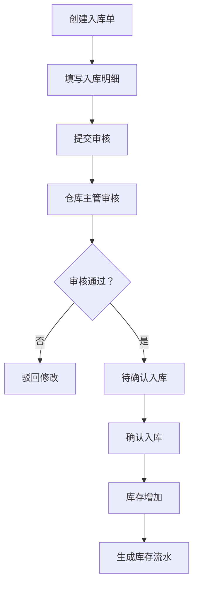
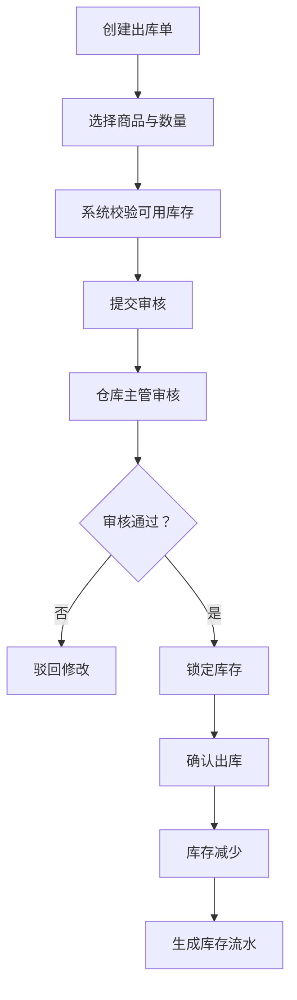
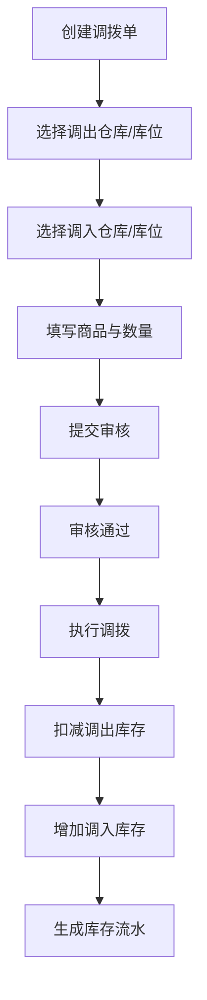
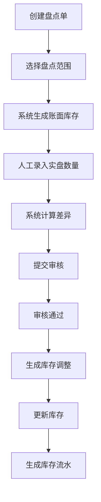

# 电子仓储管理系统 PRD

## 1. 项目概述

### 1.1 产品名称

电子仓储管理系统

### 1.2 产品定位

面向中小型企业的 Web 版仓储管理系统，用于统一管理商品、仓库、库位、库存、入库、出库、调拨、盘点、库存预警、文件附件和基础报表，提升仓储业务流转效率与库存数据准确性。

### 1.3 技术选型

| 类型 | 技术 |
|---|---|
| 前端 | Vue 3 |
| 后端 | Java Spring Boot |
| 数据库 | MySQL |
| 文件存储 | OSS |
| 接口风格 | RESTful API |
| 部署形态 | Web 系统 |

### 1.4 明确排除范围

本系统不包含以下功能：

- 扫码入库
- 扫码出库
- PDA 操作
- 条码枪接入
- 条码/二维码生成与打印
- 自动化立体仓控制
- 物流轨迹追踪
- 财务核算系统
- 电商平台自动同步

## 2. 建设目标

### 2.1 业务目标

- 实现商品、仓库、库区、库位、库存的统一管理。
- 支持完整的入库、出库、调拨、盘点业务流程。
- 确保库存数据实时、准确、可追溯。
- 支持库存预警，降低缺货或积压风险。
- 支持入库、出库、盘点、调拨等业务附件上传至 OSS。
- 支持基础数据导入导出与业务报表导出。

### 2.2 系统目标

- 支持多仓库管理。
- 支持用户、角色、菜单、按钮、仓库数据权限控制。
- 支持库存流水追踪。
- 支持单据审核流。
- 支持 MySQL 事务保证库存一致性。
- 支持 OSS 私有文件存储和临时访问 URL。

## 3. 用户角色

| 角色 | 说明 |
|---|---|
| 系统管理员 | 管理用户、角色、权限、系统参数 |
| 仓库主管 | 审核单据、查看报表、处理库存异常 |
| 仓管员 | 负责入库、出库、移库、盘点等日常操作 |
| 采购人员 | 创建采购入库单、查看入库状态 |
| 销售/业务人员 | 创建销售出库单、查看出库状态 |
| 财务人员 | 查看库存金额、出入库统计、盘点损益 |

## 4. 功能范围

### 4.1 一期功能范围

- 登录认证
- 用户管理
- 角色权限管理
- 商品管理
- 商品分类管理
- 供应商管理
- 客户管理
- 仓库管理
- 库区/库位管理
- 入库管理
- 出库管理
- 实时库存
- 库存流水
- OSS 文件上传
- 基础报表
- 操作日志

### 4.2 二期功能范围

- 调拨管理
- 盘点管理
- 库存预警
- Excel 导入导出增强
- 报表中心增强
- 操作审计增强

## 5. 核心业务流程

### 5.1 入库流程



### 5.2 出库流程



### 5.3 调拨流程



### 5.4 盘点流程



## 6. 功能需求

### 6.1 登录与权限

#### 功能说明

用户通过账号密码登录系统，系统基于角色和数据权限控制用户可访问资源。

#### 功能点

- 用户登录
- 用户登出
- 修改密码
- 登录状态过期处理
- 菜单权限控制
- 按钮权限控制
- 仓库数据权限控制

#### 业务规则

- 密码必须加密存储。
- 用户禁用后不可登录。
- 用户只能访问被授权仓库的数据。
- 所有业务接口必须进行登录鉴权。

### 6.2 用户管理

#### 功能点

- 新增用户
- 编辑用户
- 启用/禁用用户
- 重置密码
- 分配角色
- 绑定可管理仓库

#### 主要字段

| 字段 | 说明 |
|---|---|
| 用户名 | 登录账号，唯一 |
| 姓名 | 用户真实姓名 |
| 手机号 | 联系方式 |
| 邮箱 | 可选 |
| 角色 | 用户所属角色 |
| 状态 | 启用/禁用 |
| 所属仓库 | 数据权限范围 |

### 6.3 商品管理

#### 功能说明

维护仓储系统中的商品基础资料。

#### 功能点

- 新增商品
- 编辑商品
- 删除商品
- 启用/禁用商品
- 商品分类维护
- 商品图片上传至 OSS
- 商品 Excel 导入
- 商品 Excel 导出

#### 主要字段

| 字段 | 说明 |
|---|---|
| 商品编码 | 系统唯一 |
| 商品名称 | 必填 |
| 商品分类 | 必填 |
| 规格型号 | 可选 |
| 单位 | 个、箱、件等 |
| 品牌 | 可选 |
| 成本价 | 可选 |
| 销售价 | 可选 |
| 商品图片 | OSS 文件 |
| 状态 | 启用/禁用 |
| 备注 | 可选 |

### 6.4 仓库与库位管理

#### 功能说明

支持仓库、库区、库位三级结构。

```text
仓库 -> 库区 -> 库位
```

#### 仓库功能点

- 新增仓库
- 编辑仓库
- 禁用仓库
- 查看仓库详情

#### 库区/库位功能点

- 新增库区
- 编辑库区
- 禁用库区
- 新增库位
- 编辑库位
- 禁用库位
- 查询库位库存

#### 业务规则

- 仓库编码唯一。
- 库位编码唯一。
- 已有库存的库位不可直接删除。
- 禁用的库位不可作为入库或调拨目标。

### 6.5 入库管理

#### 入库类型

- 采购入库
- 退货入库
- 调拨入库
- 其他入库

#### 功能点

- 创建入库单
- 编辑草稿入库单
- 删除草稿入库单
- 提交审核
- 审核通过
- 审核驳回
- 确认入库
- 上传入库附件
- 查看入库详情
- 导出入库单

#### 单据状态

| 状态 | 说明 |
|---|---|
| 草稿 | 可编辑 |
| 待审核 | 等待主管审核 |
| 已驳回 | 需修改后重新提交 |
| 待入库 | 审核通过，等待确认入库 |
| 已完成 | 库存已增加 |
| 已取消 | 单据作废 |

#### 业务规则

- 草稿状态可编辑和删除。
- 待审核状态不可编辑明细。
- 审核通过后进入待入库状态。
- 确认入库后增加库存并生成库存流水。
- 已完成入库单不可修改。

### 6.6 出库管理

#### 出库类型

- 销售出库
- 领用出库
- 调拨出库
- 其他出库

#### 功能点

- 创建出库单
- 编辑草稿出库单
- 删除草稿出库单
- 可用库存校验
- 提交审核
- 审核通过
- 审核驳回
- 库存锁定
- 确认出库
- 取消出库
- 上传出库附件
- 查看出库详情
- 导出出库单

#### 业务规则

- 出库数量不能大于可用库存。
- 审核通过后锁定库存。
- 确认出库后扣减总库存和锁定库存。
- 已完成出库单不可修改。
- 已锁定库存取消时应释放库存。
- 任何情况下不可出现负库存。

### 6.7 库存管理

#### 功能说明

展示商品在各仓库、库区、库位中的实时库存。

#### 功能点

- 库存查询
- 按商品查询
- 按仓库查询
- 按库位查询
- 库存预警
- 库存导出
- 查看库存流水

#### 库存字段

| 字段 | 说明 |
|---|---|
| 商品 | 商品信息 |
| 仓库 | 所属仓库 |
| 库区 | 所属库区 |
| 库位 | 所属库位 |
| 总库存 | 当前账面库存 |
| 可用库存 | 可出库库存 |
| 锁定库存 | 已被出库单占用库存 |
| 预警下限 | 库存不足预警值 |
| 预警上限 | 库存过高预警值 |

#### 计算规则

```text
总库存 = 可用库存 + 锁定库存
```

入库完成：

```text
总库存增加
可用库存增加
```

出库审核通过：

```text
可用库存减少
锁定库存增加
```

出库完成：

```text
锁定库存减少
总库存减少
```

出库取消：

```text
锁定库存减少
可用库存增加
```

### 6.8 库存流水

#### 功能说明

记录所有库存变动，确保库存可追溯。

#### 流水类型

- 入库
- 出库
- 调拨
- 盘点调整
- 手工调整

#### 业务规则

- 库存流水不可删除。
- 库存流水不可修改。
- 所有影响库存的操作必须生成流水。
- 库存变更和库存流水必须在同一个数据库事务中完成。

### 6.9 调拨管理

#### 调拨类型

- 仓库间调拨
- 同仓库库位调拨

#### 功能点

- 创建调拨单
- 编辑调拨单
- 提交审核
- 审核调拨单
- 执行调拨
- 查看调拨详情
- 导出调拨单

#### 业务规则

- 调出库位可用库存必须充足。
- 调出库位和调入库位不能完全相同。
- 执行调拨后生成调出和调入库存流水。

### 6.10 盘点管理

#### 功能点

- 创建盘点单
- 选择盘点仓库
- 选择盘点库位
- 生成账面库存
- 录入实盘数量
- 自动计算盘盈/盘亏
- 提交审核
- 审核盘点单
- 库存调整
- 上传盘点附件
- 导出盘点结果

#### 业务规则

- 盘点单生成后记录当时账面库存。
- 实盘数量由人工录入。
- 盘点差异需审核后才能调整库存。
- 已调整的盘点单不可重复调整。

### 6.11 文件上传与 OSS

#### 使用场景

- 商品图片
- 入库附件
- 出库附件
- 盘点附件
- 调拨附件
- Excel 导入文件
- 报表导出文件

#### 功能点

- 文件上传
- 文件下载
- 文件预览
- 文件删除
- 文件访问权限控制

#### 业务规则

- 文件实际内容存储至 OSS。
- 数据库仅保存文件元数据和 OSS Key。
- 私有文件通过后端生成临时访问 URL。
- 删除业务单据时不建议物理删除文件，可解除业务关联。

### 6.12 报表中心

#### 报表类型

- 当前库存报表
- 库存预警报表
- 入库统计报表
- 出库统计报表
- 商品出入库明细报表
- 盘点差异报表
- 调拨统计报表

#### 查询维度

- 时间范围
- 商品
- 商品分类
- 仓库
- 库区
- 库位
- 单据类型
- 操作人

### 6.13 操作日志

#### 记录范围

- 登录
- 新增
- 编辑
- 删除
- 审核
- 驳回
- 确认入库
- 确认出库
- 库存调整
- 文件上传
- 文件删除

## 7. 页面规划

| 模块 | 页面 |
|---|---|
| 登录 | 登录页 |
| 首页 | 数据看板 |
| 基础资料 | 商品管理、分类管理、供应商管理、客户管理 |
| 仓库管理 | 仓库管理、库区管理、库位管理 |
| 入库管理 | 入库单列表、创建入库单、入库详情 |
| 出库管理 | 出库单列表、创建出库单、出库详情 |
| 库存管理 | 实时库存、库存流水、库存预警 |
| 调拨管理 | 调拨单列表、创建调拨单、调拨详情 |
| 盘点管理 | 盘点单列表、创建盘点单、盘点详情 |
| 报表中心 | 库存报表、出入库报表、盘点报表 |
| 系统管理 | 用户管理、角色管理、权限管理、操作日志 |

## 8. 非功能需求

### 8.1 性能要求

- 常规列表查询响应时间小于 2 秒。
- 库存查询响应时间小于 3 秒。
- 单次导入建议支持 5000 条以内。
- 报表导出建议采用异步任务。

### 8.2 安全要求

- 密码加密存储。
- 登录接口防暴力破解。
- 所有接口需鉴权。
- 文件访问需权限校验。
- 关键操作记录日志。
- 防止越权访问仓库数据。

### 8.3 数据一致性

- 入库、出库、调拨、盘点调整必须使用数据库事务。
- 库存扣减需防止并发超卖。
- 库存流水与库存变更必须在同一事务内完成。
- 出库时不得出现负库存。

## 9. 验收标准

- 用户可以登录系统并根据角色访问对应菜单。
- 管理员可以维护商品、仓库、库区、库位。
- 用户可以创建、审核、完成入库单。
- 入库完成后库存正确增加，并生成库存流水。
- 用户可以创建、审核、完成出库单。
- 出库过程中系统校验可用库存，完成后库存正确减少。
- 库存流水可完整追踪库存变化。
- 文件可上传至 OSS，并能在业务单据中查看。
- 报表可以按时间、商品、仓库维度查询。
- 系统不包含扫码、PDA、条码相关入口和流程。
